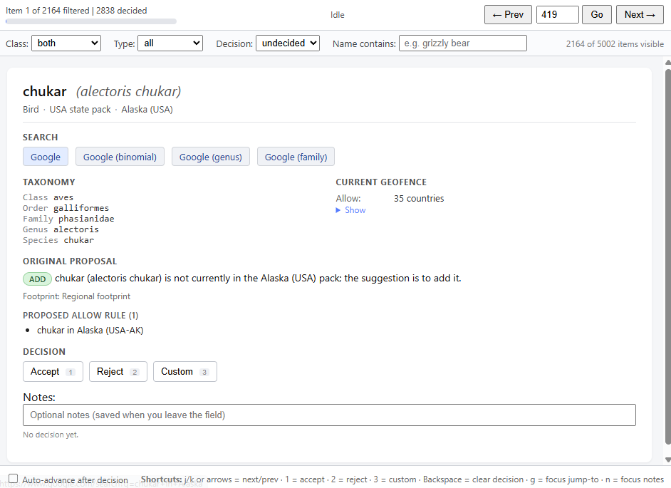

# SpeciesNet geofence review

This repo holds tools used to validate a batch of suggested changes to the [SpeciesNet geofence](https://github.com/google/cameratrapai/blob/main/data/model_package/geofence_release.json) against the current geofence and taxonomy, and to walk through each suggestion in a local browser UI.

The four "suggestion" files (`Systematic_review.json`, `Canada_review.json`, `USA_review.json`, `USA_State_review.json`) and all generated outputs live in the **data folder**, which is `G:\temp\speciesnet-geofence-review-data` at the time of writing. All file paths referenced below are relative to that folder unless otherwise noted; the single source of truth for the path is `paths.py`.

Thanks to [Hugo Markoff](https://www.linkedin.com/in/hugo-markoff/) for finding all of these candidates for geofence adjustment.  See [this repo](https://github.com/hugomarkoff/animal_detect_geofence/) for more details about the process he used.


## The suggestion files

All four files are JSON. The `itemId` of every item is the GUID from the [SpeciesNet taxonomy](https://github.com/google/cameratrapai/blob/main/data/model_package/taxonomy_release.txt) (`GUID;class;order;family;genus;species;commonName`). The `binomial` field is the `genus species` portion. The `label` is `commonName (binomial)`. `classLabel` is a human-readable class ("Bird", "Mammal", "Reptile", ...).

### Common per-item fields (regional files)

Every item in the regional files (Canada, USA, USA-State) has:

| Field | Meaning |
| --- | --- |
| `itemId` | Taxonomy GUID. |
| `label` | `commonName (binomial)`. |
| `commonName` | Common name from taxonomy. |
| `binomial` | `genus species`. |
| `classLabel` | "Bird", "Mammal", etc. |
| `status` | `new_record` (in `addSuggestions`) or `likely_false` (in `removeSuggestions`). |
| `bucket` | `New` (in `addSuggestions`) or `Needs Review` (in `removeSuggestions`). The summary also reports `Likely Valid` and `Unlisted` buckets — those items are not surfaced as suggestions. |
| `expected` | `true` if the species is currently allowed in this region; `false` otherwise. So `addSuggestions` entries have `expected: false` and `removeSuggestions` entries have `expected: true`. |
| `footprintCode` / `footprintLabel` | Source-evidence shape: `countrywide` / "National footprint", `regional` / "Regional footprint", `no_points` / "No mapped points", `needs_review` / "Pending review", `country_pack_only` / "State pack only" (state files only). |

### `Canada_review.json` and `USA_review.json`

Per-country review files. Top-level structure:

```
{
  "schemaVersion": 1,
  "generatedAtUtc": "...",
  "generatedFor": "CAN" | "USA",
  "countryName": "Canada" | "United States",
  "sourceFiles": [...],
  "summary": {
    "total": <int>,
    "packBucketCounts": { "Likely Valid": ..., "Unlisted": ..., "Needs Review": ..., "New": ... },
    "suggestedAddCount": <int>,
    "suggestedRemoveCount": <int>
  },
  "addSuggestions":    [ <item>, ... ],   // species NOT currently allowed in the country, but suggested to add
  "removeSuggestions": [ <item>, ... ]    // species currently allowed in the country, but suggested to remove
}
```

`addSuggestions` ↔ the species should currently be absent from the country (no `allow` entry, or `allow` present but country missing; or `block` entry covering the country). `removeSuggestions` ↔ the species should currently be present in the country.

### `USA_State_review.json`

Same per-state structure, but wrapped in a top-level array indexed by state. The state-level "current state" check uses the admin1 logic from [`speciesnet/geofence_utils.py`](https://github.com/google/cameratrapai/blob/main/speciesnet/geofence_utils.py):

A taxon is currently allowed in `USA-<ST>` iff its geofence entry either (a) has no entry at all, or (b) has an `allow` dict where `USA` maps to `[]` (countrywide) or a list that contains `<ST>`, or (c) has only a `block` dict where USA is absent, or where USA maps to a list that does not include `<ST>`.

Top-level structure:

```
{
  "schemaVersion": 1,
  "generatedAtUtc": "...",
  "sourceFiles": [...],
  "stateCount": 51,
  "states": [
    {
      "generatedFor": "USA-AK",
      "countryName": "United States – Alaska",
      "summary": { ... },
      "addSuggestions":    [ <item>, ... ],
      "removeSuggestions": [ <item>, ... ]
    },
    ...
  ]
}
```

### `Systematic_review.json`

Organized by taxon rather than by region. Each item proposes a global revision of a taxon's footprint:

```
{
  "schemaVersion": 1,
  "generatedAtUtc": "...",
  "sourceFiles": [...],
  "items": [
    {
      "rank": <int>,
      "itemId": "<guid>",
      "label": "...",
      "commonName": "...",
      "binomial": "...",
      "classLabel": "...",
      "status": "pending",
      "reviewCountryCount": <int>,
      "proposalSummary": "...",
      "keepCountryCount": <int>,
      "removeCountryCount": <int>,
      "addCountryCount": 0,
      "keepCountries":   [ "ISO3", ... ],   // currently allowed, suggested to keep allowed
      "removeCountries": [ "ISO3", ... ]    // currently allowed, suggested to remove
    },
    ...
  ]
}
```

Every country code is ISO-3166 alpha-3. `addCountryCount` is always `0` in this file (the systematic pass only proposes removals or no-ops on existing allowances).

Implied current state: every code in `keepCountries` and `removeCountries` must currently be allowed for that taxon. `reviewCountryCount` should equal `keepCountryCount + removeCountryCount + addCountryCount`.

## Geofence semantics (recap)

Per [`speciesnet/geofence_utils.py`](https://github.com/google/cameratrapai/blob/main/speciesnet/geofence_utils.py), a taxon `T` is allowed in country `C` (optional admin1 `R`) when:

- `T` has no entry in `geofence_release.json` → allowed everywhere; OR
- `T` has an `allow` block: `C` must be a key, and either its value is `[]` (countrywide) or contains `R`; AND
- `T` has a `block` block: either `C` is not a key, or its value is a non-empty list that does not contain `R`.

If both `allow` and `block` exist, both checks must pass.

## Tools

| Path | Purpose |
| --- | --- |
| `paths.py` | Central definition of `DATA_DIR` and every other path the code uses (suggestion files, generated outputs, external SpeciesNet inputs). Edit `DATA_DIR` to move the data folder. |
| `verify_suggestions.py` | Validates every suggestion: GUID/binomial/commonName match taxonomy; implied "currently allowed/not allowed" matches the geofence. Writes summaries + `verification_mismatches.json` + `verification_inconsistencies.{json,md}` to the data folder. |
| `review_queue.py` | Loads the four suggestion files + taxonomy + geofence and flattens them into a single review queue (hiding the items the verifier categorized as auto-handled). Importable; also runnable for a queue-size sanity print. |
| `review_app.py` | Local Flask web app for walking through the queue with keyboard shortcuts; auto-saves decisions to `decisions.json` in the data folder. |
| `bulk_apply.py` | Applies natural-language batches of decisions ("rounds") to `decisions.json`. Each round is its own function. |
| `templates/index.html`, `static/{style.css,app.js}` | Frontend for the Flask app. |
| `requirements.txt` | Python dependencies. |

Run from this folder with the `speciesnet-geofence-review` conda environment active.

## Workflow

1. **Verify.** `python verify_suggestions.py` -- one-shot sanity check; produces a mismatch report and a human-readable `verification_inconsistencies.md` listing items the UI auto-handles.
2. **Review.** `python review_app.py` -- launches a local Flask server on `http://127.0.0.1:5000/` and opens your default browser. The queue starts at the first undecided item; every decision is saved to `decisions.json` immediately.
3. **Export.** (Future) Convert `decisions.json` into rows for `geofence_fixes.csv`. Not in this repo yet.

### UI shortcuts

| Key | Action |
| --- | --- |
| `j` / `ArrowRight` / `Space` | Next item |
| `k` / `ArrowLeft` | Previous item |
| `0` or `i` | Ignore |
| `1` / `2` / `3` / `4` | Allow at species / genus / family / order (for regional items); `1` = Accept proposal (for systematic items) |
| `5` / `6` / `7` / `8` | Block at species / genus / family / order (for regional items); `5` = Reject proposal (for systematic items) |
| `Backspace` or `u` | Clear decision on current item |
| `g` | Focus the "jump to #" input |
| `n` | Focus the notes field |

For systematic items you can also click individual country chips in the per-country breakdown to flip a proposed `remove` to `keep` (or vice versa); the override is saved alongside the outcome.

## Gratuitous screenshot

